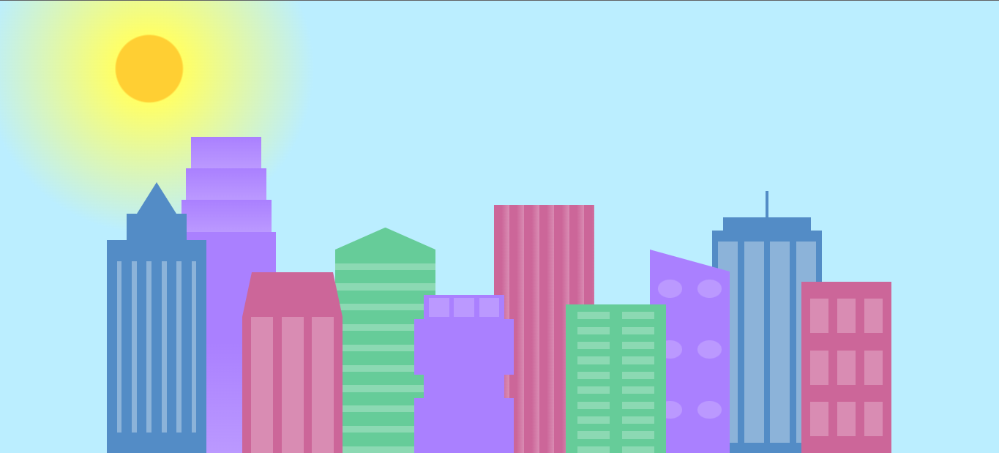

# City Skyline

City Skyline is a simple web page that displays a city skyline using HTML and CSS. It creates a visual representation of buildings in the background and foreground.

## Table of Contents

- [Demo](#demo)
- [Features](#features)
- [Installation](#installation)
- [Usage](#usage)
- [Customization](#customization)
- [Contributing](#contributing)
- [License](#license)

## Demo

You can view a live demo of City Skyline [here](https://github.com/CodeMegan27/City_Skyline.git).

## Features

- Displays a visually appealing city skyline.
- Utilizes CSS gradients and shapes to create the skyline.
- Responsive design for various screen sizes.

## Installation

To run City Skyline locally, follow these steps:

1. Clone the repository:
   bash
   git clone https://github.com/CodeMegan27/City_Skyline.git 
	
2. Open the project folder in your code editor.

3. Open the index.html file in your web browser.

##Usage
Simply open the index.html file in your web browser to view the City Skyline.

##Customization
You can customize the appearance of the skyline by modifying the CSS variables in the styles.css file. Here are some of the variables you can adjust:

--building-color1: Color of background buildings.
--building-color2: Color of background buildings.
--building-color3: Color of background buildings.
--building-color4: Color of background buildings.
--window-color1: Color of windows in background buildings.
--window-color2: Color of windows in background buildings.
--window-color3: Color of windows in background buildings.
--window-color4: Color of windows in background buildings.
Feel free to experiment and create your own unique cityscape!

##Contributing
Contributions are welcome! If you have any ideas for improvements or find any issues, please open an issue or submit a pull request.